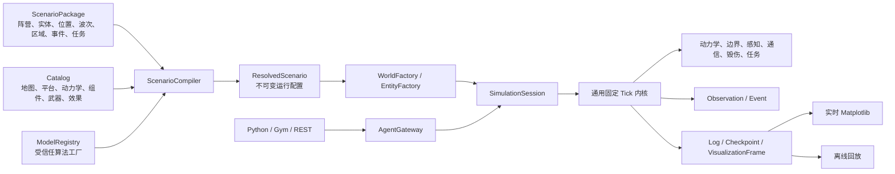

# OpenMDBench 通用组合仿真平台与接口服务需求规格

> 文档版本：2.0
> 目标系统：Ubuntu 22.04/24.04，Python 3.11/3.12；以项目元数据实际支持范围为准
> 文档性质：权威产品需求、目标架构、公共契约和验收依据
> 核心定位：通用组合仿真平台，不以任何现有正式场景作为内核模板

## 1. 文档目的

OpenMDBench 要在复用现有动力学、地理、感知、通信、能源、战斗、裁决、训练接口、日志、检查点和 Matplotlib 能力的基础上，重构为可由第三方声明式组合的通用仿真平台。

最终用户必须能够在不修改仿真内核 Python 代码的前提下：

1. 创建任意版本化场景包；
2. 定义任意数量的阵营、实体、编组、波次和控制槽位；
3. 为每个实体选择平台、动力学、传感器、通信、武器、弹药、能源、毁伤和外形资源；
4. 配置初始位置、速度、航向、高度、深度、健康和组件状态；
5. 配置地图、区域、边界、障碍、海陆、天气和环境事件；
6. 使用通用条件组合任务终止、胜负和评分；
7. 通过 Python、Gymnasium、VectorEnv 或 REST 接入智能体；
8. 获取实时 Matplotlib 可视化、权威日志、检查点和离线回放。

MD-INT-001、MD-AD-002 及其他已有场景只承担兼容性回归和示例库作用，不得决定内核数据结构、固定实体数量、固定阵营、固定武器、固定裁决器或系统执行顺序。

## 2. 范围与非目标

### 2.1 本次范围

- 通用 Catalog 和受信任 ModelRegistry；
- 声明式场景包和 ScenarioCompiler；
- 不可变 ResolvedScenario；
- 任意阵营、实体和组件组合；
- 通用 WorldFactory、EntityFactory 和系统调度；
- 底层 BoundarySystem、CollisionSystem、CombatSystem、DamageSystem 和 LifecycleSystem；
- 通用 MissionRuleEngine 和 ScoringEngine；
- SimulationSession、CommandQueue、Runner 和 AgentGateway；
- Observation、ActionBatch、Event、VisualizationFrame、Replay 和 Checkpoint；
- REST、Python、Gymnasium 和 VectorEnv；
- 实时可视化、离线回放、场景 SDK、CLI、测试和发布门禁。

### 2.2 非目标

- 不推倒重写所有已有动力学和系统模型；
- 不允许普通 YAML 执行任意 Python；
- 不承诺所有任务级抽象模型达到真实装备高保真标定；
- 第一版不把各系统拆成跨网络微服务；
- 第一版不允许任意用户上传不受信任的原生代码插件。

## 3. 术语

- **Catalog**：版本化、只读、可哈希的资源定义集合。
- **ModelRegistry**：受信任模型工厂注册表，登记动力学、探测、命中、毁伤等算法实现。
- **ScenarioPackage**：声明世界、实体实例、区域、事件、任务和评分的数据包。
- **ResolvedScenario**：所有资源引用和默认值已展开、单位和坐标已归一、不可变且可哈希的运行配置。
- **SessionRuntime**：单次仿真会话的全部可变状态。
- **EntityInstance**：平台、动力学、组件、载荷和初始状态的组合实例。
- **DamageIntent**：命中、碰撞或环境效果产生的待同时应用毁伤意图。
- **MissionRule**：对权威状态或事件的声明式条件与结果组合。
- **Legacy Scenario**：重构前存在的正式场景，仅用于兼容回归。
- **Synthetic Genericity Scenario**：验证通用组合能力、不得来自旧场景结构的合成场景。

## 4. 设计原则

### AR-001 场景无关内核

生产内核不得按场景 ID、场景类名或固定实体 ID 分支。禁止新增：

```python
if scenario_id == "MD-INT-001":
    ...
```

场景改名但 resolved 内容不变时，逻辑结果必须等价。

### AR-002 数据组合优于场景继承

实体由资源和初始状态组合，不为每个任务建立专用实体继承树或专用主循环。

```text
EntityInstance = PlatformProfile
               + DynamicsProfile
               + Component/Loadout Profiles
               + InitialState
               + ControllerBinding
```

### AR-003 底层机制与场景政策分离

- 底层实现运动、边界、碰撞、探测、通信、命中、毁伤和生命周期机制；
- Catalog 提供模型和参数档案；
- 场景选择资源、实例、区域、政策、任务和评分；
- 普通场景不得实现底层算法。

### AR-004 编译后运行

运行中不解析 YAML、不查询最新资源、不展开编组、不执行配置脚本。所有配置在会话创建前编译为 ResolvedScenario。

### AR-005 单会话单写入者

每个 SimulationSession 只有一个固定 tick 写入循环。API、Gym、可视化和检查点只能通过会话接口交互。

### AR-006 契约唯一

Observation、ActionBatch、Event、VisualizationFrame、ReplayMetadata 和 Checkpoint 各有唯一版本化语义源。

### AR-007 确定性优先

同一引擎版本、resolved hash、seed 和动作时间线产生结构等价结果；请求频率、显示频率、speed ratio 和并发调度不得改变逻辑结果。

### AR-008 声明式配置与受信任扩展分离

参数、组合和任务规则通过配置完成；全新的动力学、传感器、命中或毁伤算法通过受信任插件和 ModelRegistry 扩展。

## 5. 总体架构



## 6. 自定义能力分层

### 6.1 场景配置可自定义

- 阵营数量和关系；
- 实体数量、ID、标签、控制权和生成时间；
- 平台、动力学参数档案和组件组合；
- 传感器、通信、武器、弹药、能源和外形；
- WGS84、局部坐标或地图坐标位置；
- 速度、航向、高度、深度、健康和组件状态；
- 地图、区域、边界政策、障碍、天气和环境；
- 波次、编组、随机化和动态事件；
- 交战政策、任务条件、终局优先级和评分；
- 智能体控制槽位、可见性和可视化设置。

### 6.2 Catalog 可扩展

受信任资源作者可以增加参数化资源档案，但不得在资源文件中嵌入任意可执行代码。

### 6.3 模型插件可扩展

新算法必须实现稳定插件协议，声明输入输出、单位、版本、确定性、线程/进程安全和测试，并经过代码审查后进入受信任注册表。

## 7. Catalog 需求

### CAT-001 资源类别

至少支持 maps、platforms、dynamics、collision_shapes、sensors、communications、weapons、ammunition、effects、damage_models、energy、environments、loadouts、mission primitives、scoring primitives、visualization assets 和 trusted model plugins。

### CAT-002 资源身份

每个资源至少包含：

```yaml
id: anti_surface_missile
version: 1.0.0
schema_version: "2.0"
display_name: Anti-surface missile
model: probability_distance_contact_v1
compatibility:
  engine: ">=2.0,<3.0"
```

正式场景使用 `id@version` 精确引用。资源内容哈希进入 ResolvedScenario、日志、检查点和回放。

### CAT-003 资源与运行状态分离

Catalog 只读；健康、弹药、冷却、能源、传感器模式、通信队列和 RNG 均属于 SessionRuntime。不同会话不得共享可变资源实例。

### CAT-004 平台资源

平台定义域、类别、尺寸、质量或任务级等价参数、碰撞体、健康阈值、组件槽位、允许动力学、允许载荷、能源、可视化和保真度说明。

### CAT-005 武器和毁伤分层

- WeaponProfile：目标兼容、交战包线、制导/命中模型、cooldown、功耗和 effect 引用；
- Ammunition：实例载荷数量和状态；
- EffectProfile：命中或环境作用产生的效果参数；
- DamageModel：把效果转成平台/组件毁伤；
- ROE：场景任务政策；
- Scoring：任务评分。

武器资源不得包含任务胜负或比赛得分。

### CAT-006 兼容性

编译阶段拒绝平台—动力学不兼容、槽位超限、载荷超载、武器目标域不匹配、固定设施绑定移动动力学、未知模型、非法单位和循环引用。

## 8. 阵营与关系

### FAC-001 任意阵营

底层不得固定红蓝两方。场景声明一个或多个 faction，并定义 hostile、friendly、neutral、protected 或任务自定义关系。

```yaml
factions:
  - id: defender
  - id: attacker
  - id: civilian
relationships:
  - {source: defender, target: attacker, relation: hostile}
  - {source: defender, target: civilian, relation: protected}
```

### FAC-002 可见性和权限

Observation、交战合法性、通信共享和可视化视角基于 faction/relationship 和显式权限，不使用 `red`/`blue` 硬编码。

## 9. 实体组合和实例化

### ENT-001 任意数量

场景实体为无固定上限的列表，实际限制来自声明的资源配额。内核不得假设实体类型、数量或部署顺序。

### ENT-002 实例结构

每个实体至少包含 identity、faction、tags、platform_ref、dynamics_ref、components/loadout、initial_state、controller_binding 和可选生命周期计划。

### ENT-003 初始状态

支持位置、姿态、速度、高度/深度、健康、能源、组件状态、传感器模式、通信状态、弹药和冷却的合法初始化。所有值编译后单位统一。

### ENT-004 批量编组

场景可使用 count、id pattern、formation、placement 和 randomization 声明批量实体。Compiler 在运行前展开为稳定、唯一的 ResolvedEntity 列表。

### ENT-005 能力驱动系统

系统通过组件和 capability 查询实体，不依赖具体场景实体类。没有对应组件的实体跳过该系统，而不是触发场景特判。

## 10. 世界、坐标和边界

### GEO-001 坐标服务

底层 GeographyService 统一处理 WGS84、局部米制坐标和已有地图坐标。内核运动使用统一局部坐标。航向为正北 0°、顺时针增加，适配器显式转换其他约定。

### BND-001 BoundarySystem

底层 BoundarySystem 负责地图范围、海陆、空域高度、水下深度、禁航区、障碍物、实体碰撞体和越界预测。场景只提供几何数据、资源引用和允许的处置政策。

### BND-002 处置政策

支持受控政策，例如 reject_command、constrain_motion、stop、reflect、collision_effect、deactivate、mission_event。算法由底层实现，场景不得执行任意代码。

### BND-003 碰撞

动力学先产生候选状态；Boundary/Collision 系统按稳定顺序检查并产生修正状态、BoundaryEvent、CollisionEvent 或 DamageIntent。结果不受实体注册顺序影响。

### BND-004 可测试性

覆盖多边形边界、海岸线、岛屿、禁区、高度/深度、静态障碍、实体碰撞、高速跨越和边界数值容差。

## 11. 通用战斗、毁伤和生命周期

### CBT-001 交战流水线

```text
EngagementRequest
→ 权限/ROE/contact/包线/弹药/cooldown 合法性
→ WeaponExecution
→ HitModel
→ EffectProfile
→ DamageIntent
→ 同时 DamageResolution
→ Component/Health/Lifecycle 更新
→ 权威事件
```

### CBT-002 稳定合法性

检查顺序和拒绝码版本化。非法请求不消耗弹药、不推进武器 RNG、不产生部分副作用。

### DMG-001 DamageSystem

底层 DamageSystem 接收命中、碰撞和环境产生的 DamageIntent，按目标稳定聚合后同时应用。支持健康、组件、功能降级、disabled、destroyed 和可配置的恢复/修理扩展。

### DMG-002 模型与参数

毁伤算法由内置或受信任 DamageModel 提供；EffectProfile 和 DamageProfile 提供版本化参数。场景可选择资源和白名单覆盖，不得直接修改目标健康或实现毁伤公式。

### DMG-003 证据

每次武器或碰撞作用记录来源、目标、模型版本、输入效果、RNG 样本、组件毁伤、健康变化和生命周期转换。

### LIFE-001 生命周期

实体状态至少支持 scheduled、active、degraded、disabled、destroyed、despawned。状态转换集中处理，不分散在场景代码中。

## 12. 通用任务规则和评分

### MIS-001 声明式规则

任务终止和胜负由通用条件组合，不为每个场景编写专用裁决器。基础条件至少包括 entity/selector enters/leaves zone、entity state、any/all/count、survival、elapsed time、event occurred、wave completed、contact、communication、resource threshold、score threshold 和 all/any/not 组合。

### MIS-002 选择器

规则通过 faction、tag、platform、domain、entity ID 或 component capability 选择实体，不引用硬编码红蓝对象。

### MIS-003 优先级和锁存

终局规则具有显式优先级、触发证据和锁存。终局后重复调用返回相同结果。

### SCR-001 评分

评分由权威事件和状态指标计算；胜负、比赛排名和训练 reward 分离。N/A 使用空值语义并按规则重新归一化。

### MIS-004 插件边界

通用原语无法表达的全新任务算法可以作为受信任 MissionPlugin 扩展，但不得进入主循环场景 ID 分支。

## 13. 场景包和编译器

### SCN-001 标准结构

```text
scenario-package/
├── scenario.yaml
├── factions.yaml
├── entities.yaml
├── formations.yaml
├── world.yaml
├── events.yaml
├── mission.yaml
├── scoring.yaml
├── randomization.yaml
├── README.md
├── tests/
└── assets/
```

允许合并为单文件，但语义必须等价。

### SCN-002 声明式事件

事件使用白名单类型：spawn、despawn、weather_change、zone_activation、jamming_start/end、component_suppression、message、mission_marker、apply_effect 等。`apply_effect` 只能引用受信任 EffectProfile。

### CMP-001 编译流水线

按稳定顺序执行：语法/schema、资源版本、默认值、单位、阵营关系、编组展开、实体兼容、坐标转换、边界和部署、事件依赖、任务/评分、控制槽位、可见性、稳定排序、冻结和哈希。

### CMP-002 ResolvedScenario

ResolvedScenario 必须参数完整、引用展开、编组展开、坐标已转换、单位统一、不可变、可序列化、可哈希，并能直接创建会话。

### CMP-003 错误质量

错误包含稳定代码、文件、字段路径、错误值、原因和建议，不只返回 Python traceback。

### CMP-004 重复编译

同一输入、Catalog、插件版本和编译器版本生成规范化结构等价结果和相同哈希。

## 14. 通用固定 Tick 内核

所有场景使用同一系统流水线：

1. 取本 tick 到达动作；
2. 原子校验、幂等和持续命令替换；
3. 投递通信和到期场景事件；
4. 解析导航、模式和自动能力；
5. 推进具有 dynamics capability 的实体；
6. 执行 BoundarySystem 和 CollisionSystem；
7. 更新能源、健康和组件状态；
8. 执行传感器、track 和 fusion；
9. 生成和投递通信消息；
10. 收集并验证交战；
11. 计算命中、effect 和 DamageIntent；
12. 同时 DamageResolution 和生命周期转换；
13. 执行通用 MissionRuleEngine；
14. 更新 ScoringEngine；
15. 写事件、日志、检查点、VisualizationFrame 和下一 ObservationSnapshot。

系统只依据 capability 和 resolved 配置运行。顺序变化必须通过 ADR、版本升级和全量 golden 更新。

## 15. 会话、命令和时间

### SES-001 会话

每个会话拥有独立 ResolvedScenario、WorldState、RNG、命令、传感器/通信状态、Damage/Mission/Score 状态、日志、帧、检查点和结果。

### CMD-001 动作类型

ActionBatch 区分 persistent_commands 和 discrete_actions。无新动作时持续命令保持；一次性动作最多消费一次。

### CMD-002 生命周期

持续命令支持 queued、accepted、active、completed、replaced、expired、cancelled、failed；离散动作支持 queued、accepted、applied、executed/rejected。

### CMD-003 原子和幂等

请求线程只入队，唯一会话写入者在 tick 边界应用。command_id 和 Idempotency-Key 防止重复发射。

### RUN-001 模式

- Continuous：无客户端请求仍按固定逻辑 tick 推进并保持最后有效命令；
- Lockstep：显式 step，用于训练和确定性评测；
- Replay：只读日志，不初始化仿真内核。

### RUN-002 时间

physics_dt、decision interval、speed ratio、sim time 和 wall timeout 分离。改变 speed ratio 不改变逻辑结果。

## 16. Observation、AgentGateway 和外部接口

### OBS-001 快照

Observation 是不可变、版本化的公开快照，不持有 WorldState 引用。

### OBS-002 可见性

通过 faction、relationship、sensor/contact 和字段白名单生成，不泄漏未探测真值、隐藏 RNG、未来事件或内部裁决状态。

### GTW-001 统一入口

AgentGateway 负责 schema、权限、时间戳、幂等、动作白名单、可见性和队列接入，不实现动力学、边界、命中、毁伤或裁决。

### API-001 适配等价

Python、Gym、VectorEnv 和 REST 对相同 resolved、seed 和动作时间线产生等价规范动作与观测。

### API-002 REST

至少支持 session CRUD、observation、actions、command status、events、result、control、checkpoint/restore、visualization 和 replay/log 下载。

## 17. 可视化、日志、回放和检查点

### VIZ-001 通用外形

实体外形、尺寸、碰撞轮廓和图标来自 visualization/collision Catalog，不按场景 ID 绘制。任意实体组合必须可显示。

### VIZ-002 同一 Frame

实时和回放共用不可变 VisualizationFrame 和 Renderer；Observation 与 referee frame 分离。

### LOG-001 权威日志

记录引擎、schema、resolved、Catalog、插件和地图版本/哈希、seed、动作、命令结果、实体、contact、通信、能源、边界、碰撞、战斗、毁伤、任务、评分和帧重建数据。

### RPL-001 不重新仿真

ReplayReader 不初始化 WorldState、动力学、MMG/Taichi、感知、战斗或 RNG。

### CHK-001 完整恢复

检查点保存继续运行所需全部可变状态和所有 RNG 子流。恢复后与连续运行逐事件、终局和评分等价。

## 18. 插件、安全和资源限制

### PLG-001 受信任插件

插件声明 ID、版本、接口版本、输入输出、单位、确定性、线程/进程安全和资源需求。未知或不兼容插件在编译阶段拒绝。

### SEC-001 配置信任边界

普通场景只包含数据，不允许 import、eval、exec、shell 或任意文件访问。路径限制在场景包和批准资源根目录。

### OPS-001 配额

编译和会话创建限制实体数、事件数、资源大小、嵌套深度、日志、队列、帧、CPU、RSS、文件句柄和运行时间，并返回稳定错误。

## 19. 通用性验收门禁

在迁移任何 Legacy Scenario 作为完成证据之前，必须通过全新的 Synthetic Genericity Scenarios：

### GS-001 多阵营混合域

至少 3 个阵营、空中/水面/固定设施、同平台不同载荷、不同控制槽位和 faction 视角。

### GS-002 规模和编组

由 formation 展开 1、10、100 个实体，验证稳定 ID、部署、推进、性能和确定性。

### GS-003 边界与毁伤

覆盖地图、海陆、禁区、高度/深度、静态障碍、实体碰撞、多种武器/Effect/DamageProfile、组件降级和同时毁伤。

### GS-004 动态事件和任务组合

覆盖动态 spawn/despawn、波次、天气/干扰、区域条件、保护/摧毁/生存/超时组合和评分。

### GEN-GATE 完成条件

- 只新增 Catalog 和场景数据，不修改内核 Python；
- 场景 ID 改名不改变逻辑结果；
- 不存在固定红蓝、固定实体数和场景 ID 分支；
- 编译、运行、智能体接入、边界、毁伤、裁决、日志、实时显示、回放和检查点全部通过；
- 相同 seed 和动作时间线确定性通过；
- Python、Gym 和 REST 等价性通过。

GEN-GATE 未通过，不得进入正式场景迁移。

## 20. Legacy Scenario 兼容

MD-INT-001、MD-AD-002-EASY/MEDIUM/HARD 和其他旧场景在 GEN-GATE 后迁移为普通 ScenarioPackage。迁移只能使用通用 Catalog、Compiler、WorldFactory 和系统；不得增加场景专用内核分支。

旧场景用于验证行为兼容、坐标、确定性、日志、检查点、可视化和智能体接口。差异必须修复或形成 Accepted ADR，不得直接更新 golden 掩盖回归。

## 21. 测试要求

至少包括：

- Schema、Catalog、Compiler 单元和契约测试；
- property-based 场景组合和非法配置测试；
- entity/faction/order/seed 确定性；
- Boundary/Collision 数值和高速跨越测试；
- Weapon/Effect/Damage/Lifecycle 矩阵；
- MissionRule 组合、优先级和锁存；
- Continuous/Lockstep/Replay 时间语义；
- Observation 防泄漏和跨接口等价；
- live/replay/checkpoint 一致性；
- 1/10/100 实体和 16/32 会话；
- GS-001 至 GS-004；
- Legacy Scenario 回归；
- 安全、性能、压力和长稳。

测试必须断言状态、事件、资源变化、毁伤、终局、评分和日志，不只断言退出码或函数被调用。

## 22. 定量验收

- 全量测试 100% 通过；
- 总覆盖率不低于当前门禁且不低于 80%；
- Compiler、WorldFactory、Boundary、Damage、Mission、Command、visibility 等核心新增模块行覆盖率不低于 90%，关键分支不低于 85%；
- Ruff、格式、严格 mypy 和 Bandit 门禁通过；
- GS-001 至 GS-004 无内核代码变更完成；
- 16 并发必须通过；32 并发通过或有用户批准的资源门槛；
- 100 局批量无崩溃、死锁和跨会话污染；
- 队列、RSS、文件句柄、进程、Artist 和缓存无无界增长；
- P0/P1 为零。

## 23. 最终交付

- 本需求、实施计划、ADR 和架构图；
- Catalog、ModelRegistry 和资源 schema；
- 场景 schema、Compiler、ResolvedScenario、WorldFactory 和 EntityFactory；
- Boundary/Collision、Combat/Damage/Lifecycle、Mission/Scoring 通用系统；
- Session、Command、Runner、Gateway；
- Python/Gym/Vector/REST；
- VisualizationFrame、Matplotlib live/replay、日志和检查点；
- GS-001 至 GS-004 及通用性报告；
- Legacy Scenario 迁移包和兼容报告；
- 场景 SDK、CLI、模板和第三方接入文档；
- 全量测试、确定性、性能、安全、soak 和独立审查报告。

只有 GEN-GATE、正式迁移、全量门禁和独立发布审计全部通过，才能报告平台化重构 `DONE`。
